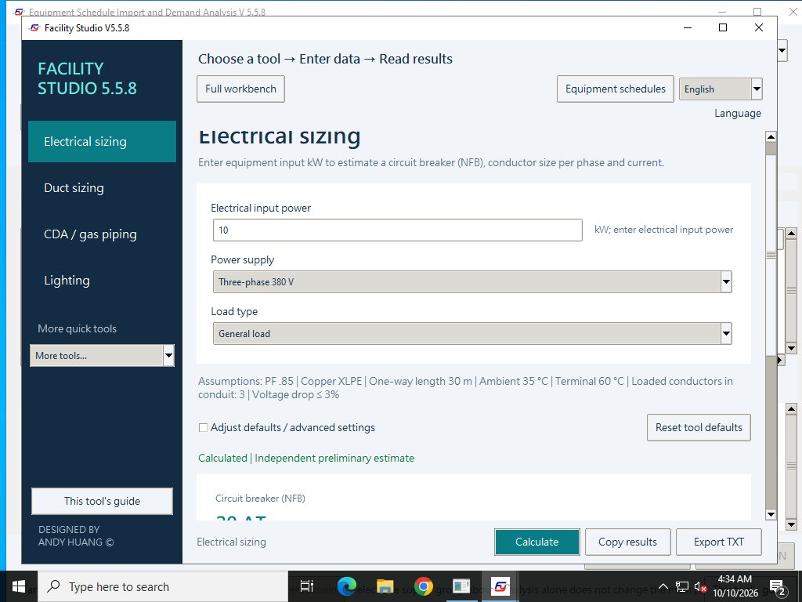

# Facility Studio | Facility engineering estimates and HVAC calculations

[繁體中文](README.md) · [User guides](docs/guides/README.en.md) · [FAQ](docs/faq.en.md) · [Report a problem](https://github.com/azx4121/facility-studio/issues)

**Turn equipment power, airflow, water flow and room conditions into engineering demands you can compare.**

Facility Studio is a desktop tool for facility, electrical and HVAC engineers. Use an independent calculator for a single question, import Excel/CSV schedules for multiple devices, or use the full workbench for HVAC schemes, AHU stages and reports.

**Windows / macOS · Traditional Chinese / English · Offline calculations · No separate Python installation**

## Download and run

Current version: **V5.5.8 public test release**.

| Platform | Download | Start |
| --- | --- | --- |
| Windows 10/11, Intel/AMD x64 | [**Download Windows EXE**](https://github.com/azx4121/facility-studio/releases/download/v5.5.8-win.1/Facility_Studio_V5_5_8_Windows_Offline.exe) | Save and double-click; allow time for the bundled environment to unpack on first launch |
| macOS, Apple Silicon / Intel | [**Download macOS DMG**](https://github.com/azx4121/facility-studio/releases/download/v5.5.8-mac.1/Facility_Studio_V5_5_8_macOS_mac1.dmg) | Open the DMG, drag Facility Studio into Applications, then launch it there |

Download one file for your platform. Help and equipment templates are bundled. [Versions and SHA256](https://github.com/azx4121/facility-studio/releases) · [Compatibility and first launch](docs/faq.en.md#compatibility)

The Windows EXE has no official publisher signature; the Mac app has no Developer ID or Apple notarization. First launch may show a security prompt. Check the download source and follow the [security-prompt guide](docs/signing.en.md).

## What can you use it for?

| Your task | What you get | Tool / example |
| --- | --- | --- |
| Estimate supply requirements for new equipment | Current, circuit-breaker and conductor candidates, preliminary voltage drop | [Electrical sizing](docs/guides/electrical.en.md) |
| Compare round and rectangular ducts for a known airflow | Dimensions and actual velocity; preliminary pressure loss when a route is supplied | [Duct sizing](docs/guides/duct.en.md) |
| Estimate CDA / nitrogen piping from flow and pressure | Actual volume flow and reference pipe diameter | [CDA / gas piping](docs/guides/gas-vacuum.en.md) |
| Check room and thermal requirements | Average lux / lamp count, water flow / capacity, air states and unit conversions | [Lighting](docs/guides/lighting.en.md) / [Water](docs/guides/water.en.md) / [Psychrometrics](docs/guides/psychrometrics.en.md) / [Units](docs/guides/units.en.md) |
| Consolidate an Excel/CSV equipment schedule | Grouped electricity, PCW, CDA, N2, EXHAUST, DI and PV demand | [Equipment schedules](docs/guides/equipment.en.md) |
| Compare HVAC schemes and AHU stage configurations | Summer/winter heat and moisture demand, preheat / precool / humidification / recool / reheat, capacity checks and reports | [Full workbench](docs/guides/workbench.en.md) / [Standalone AHU](docs/guides/ahu.en.md) |

Each quick tool works independently. Adopted conditions and defaults appear on screen and in reports, so you can review the assumptions and compare demand after a change.

*Actual V5.5.8 Windows native-acceptance screen: choose a tool on the left, enter conditions in the middle, then calculate or export below.*

## Try one small calculation first

1. Launch the app and choose **English** or **Traditional Chinese** at the top right.
2. Select a tool and enter your values and units. Review the displayed assumptions.
3. Click **Calculate**, then copy the result or export TXT. **This tool's guide** opens the relevant instructions and formulas.

Try **10 kW, three-phase 380 V, general load** with the electrical tool's defaults: expect approximately **17.87 A, a 20 AT breaker candidate and 5.5 mm² per phase**. [Complete assumptions and check](docs/guides/electrical.en.md#case-01)

For a project report, open **Full workbench → Beginner tutorial** and follow the [first six walkthrough sections](docs/guides/workbench.en.md). **Open practice copy** directly loads the MAU example with a staged AHU for the next exercise.

## Before using the results

- **Scope:** preliminary engineering estimates, scheme comparison and demand summaries. Complete equipment selection, regulatory review, fault/protection studies, pipe networks and BIM drawings need separate work.
- **Data:** calculations, saved projects and schedule imports are processed locally. User-entered names and notes retain their original language.
- **License:** internal company engineering work, paid engineering projects and delivered calculation reports are permitted. Software resale, paid bundling or paid hosted software services require separate written permission. [Full terms](LICENSE) · [License examples](LICENSE_GUIDE.en.md)

The published files passed native acceptance on Windows Server 2022/2025 x64 and Apple Silicon/Intel macOS 15. Windows 10/11 and macOS 11+ are support/packaging targets; other OS versions, devices and enterprise policies need individual confirmation. [Current fixes and verification](docs/2026-10-10-v5.5.8-native.md)

## Help and feedback

[Tool and formula guides](docs/guides/README.en.md) · [FAQ](docs/faq.en.md) · [Documentation](docs/README.en.md) · [Development and tests](docs/development.md#english) · [Historical records](docs/history/README.md#english)

Use [GitHub Issues](https://github.com/azx4121/facility-studio/issues) to report a problem. Include app/OS versions, steps, all values and units, and expected/actual results. Use synthetic data and remove client secrets.

**DESIGNED BY ANDY HUANG ©** · Maintainer [azx4121](https://github.com/azx4121) · [Third-party components](THIRD_PARTY_NOTICES.md)
