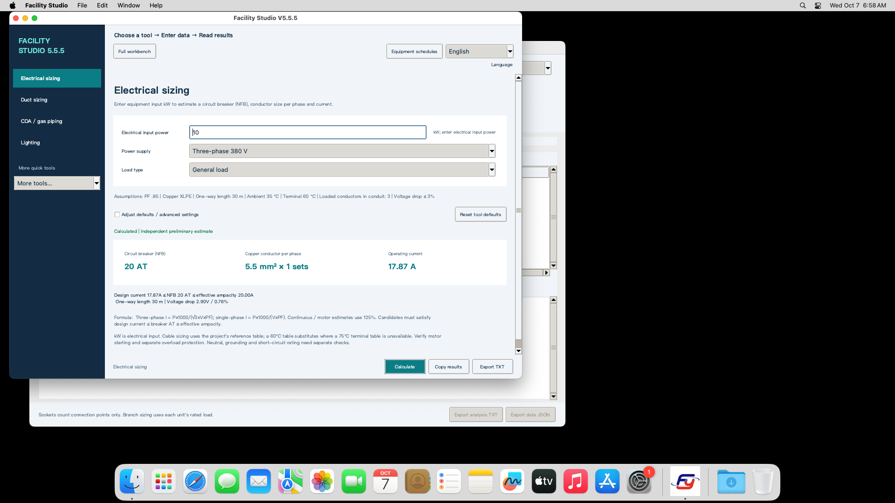

# Facility Studio — HVAC & MEP Engineering Calculators

[繁體中文](README.md) · [Documentation](docs/README.en.md) · [Worked examples](docs/guides/README.en.md) · [Downloads](https://github.com/azx4121/facility-studio/releases) · [Report a problem](https://github.com/azx4121/facility-studio/issues)

Facility Studio by **azx4121 / Andy Huang** is a Traditional Chinese / English desktop application for preliminary HVAC, electrical and facility utility calculations. The calculators can be used independently; a complete workbench supports project comparisons and seasonal AHU stage calculations. This repository is unrelated to other products or businesses with the same name.

**V5.5.7 bilingual public test release.** Windows **v5.5.7-win.1** and macOS **v5.5.7-mac.1** bundle their runtime. After downloading, normal calculations require neither a separately installed Python nor an internet connection.

V5.5.7 synchronizes largest-motor activation, ignores disabled heater efficiency and excludes inactive equipment from AHU reports/rated power. Draft inputs remain available when re-enabled. The bilingual interface and offline tutorial are synchronized.

## Download and run

| Platform | Download | Start |
| --- | --- | --- |
| Windows standalone | [Offline EXE](https://github.com/azx4121/facility-studio/releases/download/v5.5.7-win.1/Facility_Studio_V5_5_7_Windows_Offline.exe) | Double-click; target: Windows 10/11 on Intel/AMD x64 |
| macOS | [mac.1 DMG](https://github.com/azx4121/facility-studio/releases/download/v5.5.7-mac.1/Facility_Studio_V5_5_7_macOS_mac1.dmg) | Drag Facility Studio into Applications; Apple Silicon and Intel |

Download just one file for your platform. Source, templates and diagnostic scripts remain in this repository for developers. The current EXE is unsigned, and the Mac app has ad-hoc integrity signing without Developer ID or Apple notarization. See [security prompts and distribution signing](docs/signing.en.md) before first launch.

Select **English** in the top-right language selector. Open windows, field labels, choices, guidance, charts and TXT/HTML reports switch immediately; the choice is remembered on restart. Engineering inputs and formulas stay unchanged. User-entered names and notes retain their original text. Newly exported Excel/CSV templates use the selected language; both Chinese and English templates can be imported. See the [bilingual guide and verification](docs/2026-10-07-bilingual.en.md). See [installation and first launch](#installation-and-first-launch) for startup and security prompts. The Windows executable has no commercial Authenticode signature; the macOS app uses ad-hoc integrity signing, without Developer ID or notarization.

Earlier native English interface (the current release retains the author credit and tutorial entry at the bottom left):

## Beginner walkthrough

New to the full workbench? Follow the [step-by-step beginner guide](docs/guides/workbench.en.md). **The first six sections produce a practice report**; additional systems are optional.

[Download the offline tutorial](https://github.com/azx4121/facility-studio/raw/refs/heads/main/docs/tutorial/Facility_Studio_Beginner_Tutorial.zip), extract it, and open `START_HERE.html`. It includes a bilingual walkthrough, two reopenable practice workspaces and reference reports. No Python installation is needed. **V5.5.7 win.1 / mac.1 include in-app offline help and author credit**. Full workbench → Open practice copy creates a new project; only six tutorial steps are required. See the [current native-delivery record](docs/2026-10-10-v5.5.7-native.md). Older binaries can read the HTML separately.

V5.5.6 groups demand by source, circuit and season, combines panel P/Q with explicit design-current floors, and marks retained results stale while disabling export/transfer. Basic workbench navigation starts with HVAC and heat loads. Workbench actions wrap at small window widths and retain the author credit.

## Installation and first launch

### Windows

1. Download the standalone Windows EXE above and save it in a convenient folder.
2. Double-click `Facility_Studio_V5_5_7_Windows_Offline.exe`. First launch may take time while embedded libraries unpack.
3. Choose **English** at the top right. Python, pip, compilation and internet access are not required for normal use.

Windows 10/11 on Intel/AMD x64 are support targets; native release acceptance used Windows Server 2022/2025 x64. Windows ARM and 32-bit Windows were not accepted. Administrator permission is not required for ordinary use. The old V5.5.4 beta `Setup.exe` is a historical online installer, not the current startup method.

Templates can be exported from the application, and the tutorial is bundled. If startup fails, retain the complete warning and logs under `%LOCALAPPDATA%\Facility_Studio_V5_5\Logs` when reporting an issue. Developer diagnostics remain in [windows/winrelease](windows/winrelease/). A SmartScreen unknown-publisher prompt differs from an antivirus detection naming a threat; stop and report an explicit threat detection. Keep antivirus and SmartScreen enabled; see [distribution signing](docs/signing.en.md).

### macOS

1. Open `Facility_Studio_V5_5_7_macOS_mac1.dmg`.
2. Drag **Facility Studio** into **Applications**.
3. Launch from Applications, then choose **English** at the top right. Python and Homebrew are not needed; normal use is offline.
4. If the first launch is blocked because the developer cannot be verified, try launching once, then follow **System Settings → Privacy & Security → Open Anyway**, as described in [Apple's official guidance](https://support.apple.com/en-us/102445).

The app is Universal for Apple Silicon and Intel. Native acceptance used macOS 15 on both architectures; macOS 11+ is the packaging target, not evidence that every version/device was tested. It is ad-hoc integrity signed without Developer ID/notarization. Managed Macs may need IT approval.

Close the old app before replacing it; saved projects and recovery data are preserved. Templates and offline help are available in the application.

For startup/signature errors, retain the complete warning and logs under `~/Library/Logs/Facility_Studio_V5_5/` when reporting an issue. Developer diagnostics remain in [macos/macos](macos/macos/). Do not change signed files inside the App. Historical ZIP acceptance evidence remains available; current public V5.5.7 assets are EXE/DMG only, with complete ZIPs used for internal acceptance. See the [download change record](docs/2026-10-08-downloads.md).

## What it calculates

| Need | Inputs and outputs | Example |
| --- | --- | --- |
| Electrical load and cable candidates | Input kW, single/three-phase supply, PF and operating conditions → current, NFB AT, conductor candidate and voltage drop | [10 kW, 380 V](docs/guides/electrical.en.md#case-01) |
| Rectangular and round duct sizing | Airflow and maximum velocity → both sizes and actual velocities; a known route permits a static-pressure budget check | [3,000 CMH](docs/guides/duct.en.md#case-03) |
| CDA / nitrogen pipe sizing | Standard flow, gauge pressure and velocity limit → actual volume flow and reference inner diameter | [800 SLPM, 6 bar(g)](docs/guides/gas-vacuum.en.md#case-05) |
| Process vacuum | Standard flow and absolute pressure → actual volume flow and a velocity-based cross section | [150 Torr(abs)](docs/guides/gas-vacuum.en.md#case-07) |
| Average illuminance and lamp count | Area or volume plus height, fixture lumens, utilization and maintenance factors → average lux or number of fixtures | [90 m³ room](docs/guides/lighting.en.md#case-08) |
| Cooling/heating water | Flow or kW and supply/return ΔT → capacity, flow and velocity-based pipe candidate | [100 kW, ΔT 5 K](docs/guides/water.en.md#case-11) |
| Psychrometrics and live chart | Dry-bulb temperature, RH and atmospheric pressure → humidity ratio, enthalpy, dew point, wet bulb and plotted point | [35°C, 70% RH](docs/guides/psychrometrics.en.md#case-12) |
| Engineering unit conversion | Airflow, liquid flow, pressure, thermal power, length, temperature, temperature difference and Kv/Cv | [CFM / CMH](docs/guides/units.en.md#case-14) |
| Equipment schedules | Excel/CSV input for electricity, PCW, CDA, N2, EXHAUST, DI and PV → separate demand groups | [Batch analysis](docs/guides/equipment.en.md) |
| AHU / MAU stages | Seasonal preheat, precool, water-wash humidification, recool and reheat; hot-water/electric heating and separate steam humidification options | [Capacity comparison](docs/guides/ahu.en.md#case-18) |

Static pressure alone does not uniquely size a duct. Pipe pressure and velocity alone do not size a gas line without flow. Electrical kW means **electrical input**, not motor shaft output. The worked examples state the adopted defaults and distinguish calculation requirements from verified installed equipment performance.

This is not a BIM/CAD authoring package, a complete pipe-network solver, or short-circuit/protection-coordination software. Manufacturer coil/fan/pump curves, safety requirements and applicable design rules require separate review.

## Verification and source

V5.5.7 passed native acceptance on Windows Server 2022/2025 x64 and Apple Silicon/Intel macOS 15. Each source distribution passed 970 inactive-output/report checks, 52 regression scenarios / 1,247 independent checks, 20 bilingual scenarios / 3,883 checks and 20 tutorial scenarios / 87 checks. All four bilingual main/AHU reference reports are compared. Hosted acceptance does not establish compatibility with every end-user device or enterprise policy. See the [V5.5.7 source, native and SHA256 evidence](docs/2026-10-10-v5.5.7-native.md); earlier evidence remains historical.

The [20 worked scenarios](docs/guides/README.en.md) include 18 applicable calculations and two out-of-scope controls. The example verifier runs both source distributions on the current test host; it is distinct from native OS acceptance and from search discoverability tests.

Application source is in [windows](windows/) and [macos](macos/). Launch `Facility_Studio_V5_5.py` with its sibling package and resource files. Python is needed only for source development, not for running the bundled downloads.

## Report a problem

Use [GitHub Issues](https://github.com/azx4121/facility-studio/issues). Include software version, OS version and CPU, tool name, reproduction steps, every input value/unit, expected/actual result, and relevant screenshots or diagnostic logs. Use synthetic equipment data and remove client secrets.

## License

This is **source-available**, licensed under [PolyForm Noncommercial 1.0.0 plus the Internal Business Use Additional Permission](LICENSE). Normal internal company engineering work and paid engineering projects with delivered reports are permitted. Selling, renting, paid bundling or paid hosted access to the software requires separate written permission. See the [English licensing guide](LICENSE_GUIDE.en.md) for examples and the exact English license for terms.

This is not MIT or an OSI-approved open-source license. Historical MIT releases retain their original rights, documented in [LICENSE_LEGACY_MIT](LICENSE_LEGACY_MIT). Third-party packages keep their own licenses.

