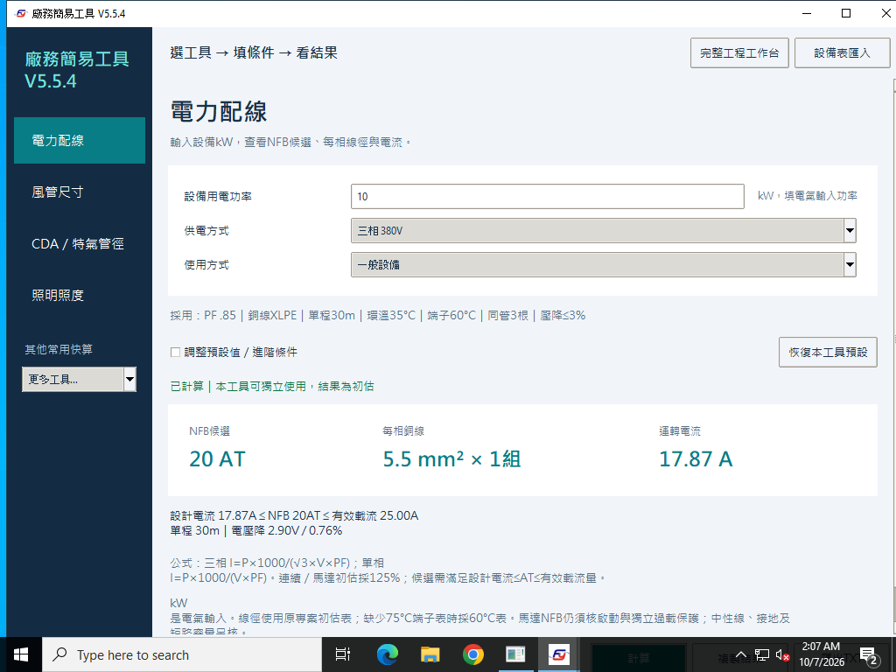

# Facility Studio｜HVAC／MEP 廠務工程計算工具

[English](README.en.md) · [文件中心](docs/README.md) · [20個操作情境與公式](docs/guides/README.md) · [下載](#下載) · [問題回報](https://github.com/azx4121/facility-studio/issues)

**azx4121／Andy Huang 維護的繁體中文／英文桌面工具**，可獨立使用電力配線、風管尺寸、CDA／N2管徑、照明Lux、冷熱水、空氣線圖及工程單位換算，也能匯入Excel／CSV彙整七種設備需求。Windows／macOS下載後可離線運算，內含Python執行環境。此倉庫與其他同名產品／工作室無關。

通用廠務工具，適合快速估算、方案比較及設備需求彙整。目前為 **V5.5.6 中英雙語公開測試版**；Windows 請下載 **v5.5.6-win.3 離線直接執行版**，macOS 請下載 **v5.5.6-mac.2**。兩者皆包含既有安全、授權與 macOS 修正；既有 Release 與歷史提交保留。

## 下載

| 平台 | 懶人包 | 使用條件 |
| --- | --- | --- |
| Windows | [下載 EXE，直接執行](https://github.com/azx4121/facility-studio/releases/download/v5.5.6-win.3/Facility_Studio_V5_5_6_Windows_Offline.exe) | Windows 10／11、Intel／AMD x64；內含執行環境，不需安裝 Python／套件，下載後可離線使用 |
| macOS | [下載 DMG，拖曳安裝](https://github.com/azx4121/facility-studio/releases/download/v5.5.6-mac.2/Facility_Studio_V5_5_6_macOS_mac2.dmg) | 拖到「應用程式」；內含執行環境，Apple Silicon／Intel 原生驗證 |

也可以到 [Releases 發布頁](https://github.com/azx4121/facility-studio/releases) 選擇版本。

每個平台只需下載上表的一個檔案。原始碼、範本與測試紀錄留在倉庫中，日常使用不需另外下載。現版尚未完成正式發行者簽章／Apple 公證；首次開啟可能有系統提示，請先閱讀[安全提示與正式認證說明](docs/signing.md)。

## 新手操作教學

第一次使用完整工作台，先看[一步步跟做教學](docs/guides/workbench.md)。**先完成前六步，就能輸出第一份練習報告**；其他系統需要時再學。

[下載離線教學懶人包](https://github.com/azx4121/facility-studio/raw/refs/heads/main/docs/tutorial/Facility_Studio_Beginner_Tutorial.zip)：解壓縮後開啟 `START_HERE.html`，內含中英逐步教學、兩份可直接開啟的練習專案及對照報告，不需安裝 Python。**V5.5.6 win.3／mac.2 已附上「新手教學」與署名**；工作台可直接「開啟練習新案」建立副本。教學只有六個必要步驟，其餘內容選讀。互鎖、需求彙整及原生交付見[修訂紀錄](docs/2026-10-07-v5.5.6-usability.md)。舊版也可單獨閱讀離線 HTML。

V5.5.6 另修正重複回傳、不同水迴路及電力 PF 的彙整；改輸入後保留標明「待重算」的舊結果，鎖住匯出及回傳。基本工作台只先顯示空調與熱負荷；可切換全部工程分頁。小視窗的操作列會自動換行，縮小後仍保留署名。

## 中英文切換

主畫面右上角的語言選單可選 **繁體中文／English**，不需重開軟體。完整工程工作台、單台空調箱及設備表視窗也有語言選單，所有已開視窗會同步切換；下次啟動會記住選擇。

欄位、下拉選項、操作提示、錯誤訊息、空氣線圖、TXT／HTML 報告及新匯出的設備範本會採用所選語言。切換不會改變已填數值、公式或專案資料；自填設備名稱與備註保持原文。既有中文 Excel／CSV 與專案檔可繼續使用，英文範本也能重新匯入。

[中英文操作與驗證記錄](docs/2026-10-07-bilingual.md)包含原生驗收、20 種數值一致性情境及限制。

## 先選你要解的問題

各快算工具可獨立使用，不需先建立完整廠房或填完所有系統。

| 你手上有的資料／問題 | 軟體入口 | 操作與已驗算案例 |
| --- | --- | --- |
| 設備kW，要估電流、NFB與線徑 | 電力配線 | [三相10 kW／單相連續負載](docs/guides/electrical.md) |
| 風量與靜壓，要比較方管／圓管 | 風管尺寸 | [3,000 CMH與路徑壓損](docs/guides/duct.md) |
| CDA／N2的流量、壓力、速度，要估管徑 | CDA／特氣管徑 | [800 SLPM、6 bar(g)](docs/guides/gas-vacuum.md) |
| PV標準抽氣量與絕對壓力，要換實際流量 | 完整工程工作台 → 特氣／PV | [150 Torr(abs)案例](docs/guides/gas-vacuum.md#case-07) |
| 空間、燈具瓦數／流明、盞數，要估Lux | 照明照度 | [體積換面積／反算燈數](docs/guides/lighting.md) |
| PCW／CHW水量、熱量、溫差，要互相反算 | 其他常用快算 → 冷熱水快算 | [100 LPM及100 kW](docs/guides/water.md) |
| 乾球與RH，要看露點、焓、濕球與即時點位 | 其他常用快算 → 空氣狀態／線圖 | [空氣線圖計算機](docs/guides/psychrometrics.md) |
| CFM／CMH、RT／kW、壓力或溫差要換單位 | 其他常用快算 → 單位換算 | [常見單位與易混淆基準](docs/guides/units.md) |
| 設備Excel／CSV，要彙總各盤與主管需求 | 設備表匯入 | [電力、PCW、CDA、N2、EXHAUST、DI、PV](docs/guides/equipment.md) |
| 空調箱預熱／預冷／水洗／再冷／再熱要比較 | 完整工程工作台 → 單台空調箱 | [冬夏分段容量與熱源](docs/guides/ahu.md) |

**先確認資料基準：**電力kW是電氣輸入；風管靜壓不是尺寸公式；CDA／N2須有流量，表壓與絕壓分開；照明Lux不是燈具流明；m³須除淨高才能得到m²。每篇案例列出條件、公式、結果及適用範圍。

以下為較早 Windows 原生驗收的真實 10 kW 中文快算畫面（現版已保留左下角署名及教學入口）；英文及 macOS 原生畫面見[雙語驗證](docs/2026-10-07-bilingual.md)，非示意介面：



## 安裝與開啟

### Windows

1. 下載上方的 **Windows EXE**，存到你方便找到的資料夾。
2. 雙擊 `Facility_Studio_V5_5_6_Windows_Offline.exe`。
3. 不需另裝 Python、不需安裝套件、不需連網；首次啟動請等候內建套件展開。

不需管理員權限。設備需求範本可在軟體內匯出；教學也已內建。
若啟動失敗，請保留警告文字或截圖，以及 `%LOCALAPPDATA%\Facility_Studio_V5_5\Logs` 中的記錄，至 Issues 回報。開發者診斷腳本保留在 [windows/winrelease](windows/winrelease/)。
本版尚無正式 Authenticode 簽章。若提示「Windows 已保護您的電腦」，可能是 SmartScreen 對新檔案／未知發行者的提示；若防毒明確列出惡意程式名稱，請停止執行並回報，不能視為同一種問題。[說明與認證規劃](docs/signing.md)列出差別；請勿關閉防毒或 SmartScreen。
舊 `v5.5.4-beta.1` 的 `Setup.exe` 線上安裝方式完整保留，新版不使用它。
詳細封裝與原生驗收記錄見 [Windows 離線版驗證](docs/2026-10-07-windows-offline.md)。

### macOS

1. 下載並打開 **V5.5.6 DMG**。
2. 把 `Facility Studio` 拖到旁邊的 `Applications／應用程式`。
3. 從「應用程式」開啟；不需另裝 Python 或 Homebrew。
4. 首次若提示開發者無法驗證，先嘗試開啟，再到「系統設定 → 隱私權與安全性 → 仍要打開」，依 [Apple 官方指引](https://support.apple.com/en-us/102445) 確認。

本版通過 Apple 原生完整性簽章檢查，但使用 ad-hoc 簽章，沒有 Developer ID／Apple 公證。企業管理的 Mac 可能需要 IT 允許。
請先關閉舊版再替換 App；更新不會刪除已儲存的專案與復原資料。設備範本與教學已可在軟體內開啟。
早期 V5.5.4 mac.1 封裝在 Apple 原生檢查中失敗；本版保留 `v5.5.4-mac.2` 的修正。[修正與驗證紀錄](docs/2026-10-06-macos-repair.md) 保留重現證據。

## 可以做什麼

| 功能 | 輸入與結果 |
| --- | --- |
| 電力配線 | 設備 kW、電壓與使用條件 → 電流、NFB 與線徑候選 |
| 方管／圓管 | 風量與流速條件 → 尺寸與實際風速；已知路徑時可進一步檢查壓損 |
| CDA／特氣 | 流量、管內壓力與流速 → 實際流量與參考管徑 |
| 照明照度 | 空間面積或體積、燈具資料 → 平均照度，或反算所需盞數 |
| 冷熱水 | 水量、熱量與溫差換算，以及管徑初估 |
| 空氣狀態 | 溫濕度 → 焓、含濕比、露點、濕球與即時空氣線圖 |
| 單位換算 | 常用工程單位，包含溫度與溫度差的分別換算 |
| 設備表匯入 | Excel／CSV 分析電力、PCW、CDA、N2、EXHAUST、DI、PV 的設備需求 |
| 完整工程工作台 | 主案與多台空調箱；夏冬逐段預熱、預冷、水洗加濕、再冷、再熱，以及熱源配置 |

各工具可獨立使用。進階條件與採用的預設值可查看、調整；報告包含條件、結果及公式。
設備範本內的示例預設未啟用，要納入計算的設備請將「啟用(1/0)」設為 1。

## 測試狀態與適用範圍

V5.5.6 新增 54 種不同條件，兩平台各通過 20 種雙語情境／3,805 項檢查、20 種教學條件／85 項檢查；既有公式與報告反算也持續驗證。原生交付與公開下載檔 SHA256 另見[本版驗收紀錄](docs/2026-10-07-v5.5.6-usability.md)。歷史 Windows 安裝器檢查保留。

V5.5.6 macOS 已通過 **Apple Silicon 與 Intel macOS 15 原生雲端驗證**：Apple 深度簽章、Tk Aqua、七種獨立工具、設備表匯入、完整工作台與 Matplotlib 繪圖。實際交付 ZIP 重新解壓縮、DMG 掛載後再次驗證。

V5.5.6 Windows 已通過 Windows Server 2022／2025 x64 原生雲端驗證：同一份 EXE 與解壓縮 ZIP，外部 Python 移出 PATH、EXE 對外連線被防火牆封鎖後，仍完成七種工具、設備表、原生 Tk 與完整工作台驗收。Windows10／11 為支援目標，使用者實機、企業政策與實體數字鍵盤仍須個別確認。

封裝目標為 macOS 11 以上；macOS 11～14、其他未驗收的 macOS 版本、Finder 下載隔離提示、企業管理政策、實體鍵盤／觸控板及 Retina 視覺仍須使用者電腦確認。
macOS 開發者診斷腳本 `Verify_on_Mac.command` 保留在 [macos/macos](macos/macos/)；一般使用者只需下載 DMG。歷史 ZIP 驗收結果仍保留，但目前推薦版本的完整 ZIP 已停止提供。

工程結果用於初估與方案比較。電氣短路與保護協調、完整管網、真空導通、設備性能選型及正式工程設計，仍需依現場條件、設備資料與適用規範覆核。
詳細驗證與限制請查看本倉庫的說明及原始碼驗證資料。

新增[20個公開操作情境](docs/guides/README.md)包含18個適用計算及2個不適用對照：短路／保護協調與BIM碰撞出圖不屬於本工具完整求解範圍。每個平台的原始碼另跑121項案例檢核，包含數值反算、報告及設備分組；此測試在目前測試主機執行，不能替代原生OS驗收。[如何搜尋與適用性測試](docs/search-discoverability.md)說明搜尋實驗及限制，不保證其他人的GPT推薦或搜尋排名。

## 回報問題

請到 [Issues 問題回報](https://github.com/azx4121/facility-studio/issues)，按 **New issue**。
為了重現問題，請提供：

- 軟體版本、作業系統版本與 CPU 架構。
- 使用哪一個工具，以及操作步驟。
- 完整輸入數值與單位。
- 預期結果、實際結果或錯誤訊息。
- 必要的畫面截圖；工程計算問題請附上反算方式。

回報範例請使用測試資料，移除業主或現場的機密資訊。

## 原始碼與授權

Windows 原始碼位於 [windows](windows/)；macOS 原始碼位於 [macos](macos/)。
各平台的啟動檔為 `Facility_Studio_V5_5.py`，請保留同層的 `facility_studio` 資料夾與資源檔。
測試與驗證紀錄分別保留於各平台的 `tests/` 與 `evidence/`；Windows 安裝器位於 `windows/installer/`，macOS 封裝腳本位於 `macos/macos/`。

目前原始碼採 [PolyForm Noncommercial 1.0.0＋公司內部使用附加許可](LICENSE)，保留 Andy Huang 及貢獻者版權標示。
**允許公司用於正常工程工作、收費案件及交付計算書；軟體轉售、付費包裝、綁售及付費線上軟體服務須另行取得書面授權。**
非商業測試與免費分享仍可進行；完整範圍及案例見 [授權說明](LICENSE_GUIDE.md)。此為公開原始碼的限制性授權，不能稱為 MIT 或 OSI 開源授權。
先前已按 MIT 發布的版本（含 `f8e92ea`）仍保有原授權；歷史條文見 [LICENSE_LEGACY_MIT](LICENSE_LEGACY_MIT)。
第三方執行環境及套件保留各自的原有授權文件，詳 [第三方元件說明](THIRD_PARTY_NOTICES.md)。

本次維護修正低溫露點反算、大氣壓防呆與工程資料表驗證，詳 [測試與修正紀錄](docs/2026-10-06-review.md)。V5.5.6 的 macOS 與 Windows 包含這些修正。歷史 Release 與標籤保留；2026-10-08 僅移除目前推薦版兩個完整 ZIP，EXE／DMG 原檔維持不變，詳[下載調整紀錄](docs/2026-10-08-downloads.md)。

### 執行數值回歸測試

在專案根目錄使用已安裝的 Python 3：

```sh
python windows/tests/regression.py
python windows/tests/v55_features.py
python windows/tests/v552_core.py
python windows/tests/simple_features.py
python windows/tests/v554_features.py
python windows/tests/maintenance_checks.py
python windows/tests/security_checks.py
python windows/tests/bilingual.py
```

macOS 原始碼測試將路徑中的 `windows/` 改為 `macos/`；若系統指令名稱為 `python3`，請使用 `python3`。
測試會更新各平台 `evidence/` 內的驗證紀錄。介面回歸另需可用的 Tk 顯示服務及測試用 Pillow／Matplotlib；數值測試無需先開啟 GUI。

安全與授權維護：XML 於解析器層阻擋 DTD／實體；JSON 限制檔案大小、64 層深度，拒絕重複欄位與非有限數值。測試記錄見 [維護紀錄](docs/2026-10-06-security-license.md)。

