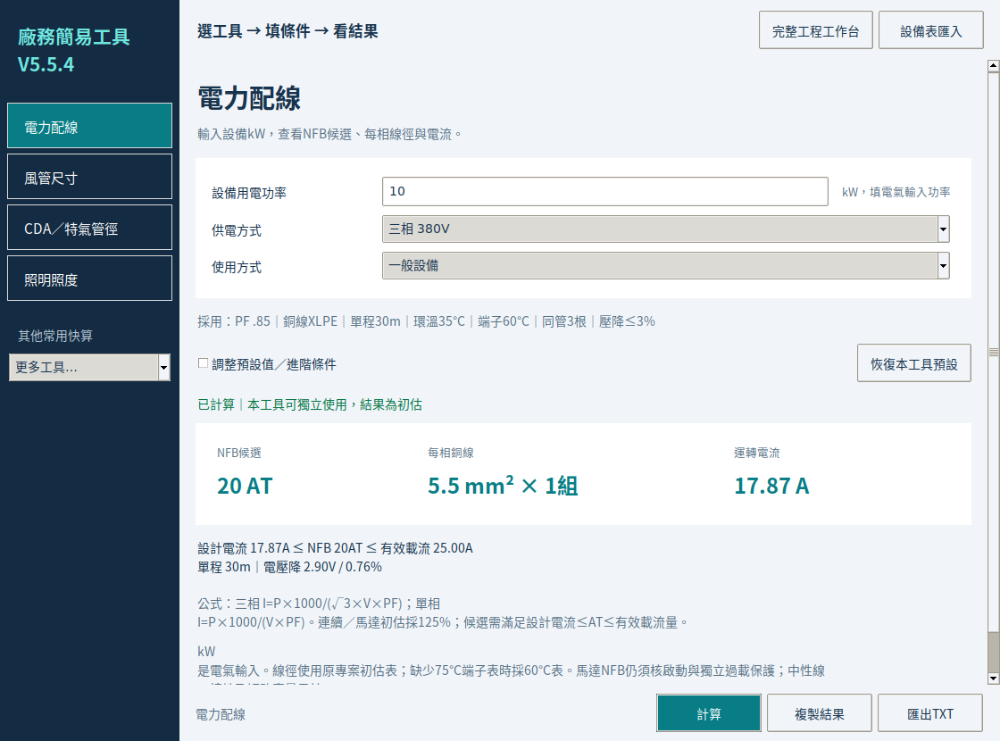
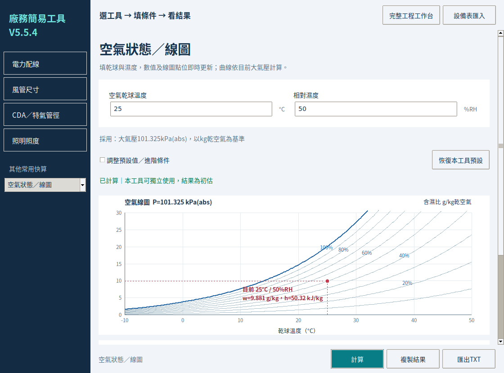

# Facility Studio V5.5.4 維護測試紀錄

以 GitHub `main` 的 `703aec4` 為基準，於 2026-10-06 實際執行兩份平台原始碼的數值、匯入、報告反算與 Tk 介面測試。保留既有功能、提交紀錄、`v5.5.4-beta.1` 標籤及 Release；本次是原始碼維護更新。

## 結果與修正

| 問題 | 修正與驗證 |
| --- | --- |
| 乾球 −50°C、10%RH 可算出 −67.217°C 的露點，但改用「乾球＋露點」就被 −60°C 限制擋下 | 露點直接由 −100～90°C 飽和蒸氣壓公式求含濕比；保留乾球 −60～90°C 的模型範圍，新增低溫反算測試。零度以下依冰面飽和公式計算霜點。 |
| 100%RH 狀態反算出的露點可能因浮點誤差略高於乾球 | 僅容許 1e-7°C 的數值誤差，並限制回到乾球；實際超出範圍的輸入仍拒絕。 |
| 工程快算先允許 30～120 kPa，底層空氣模型實際只接受 60～120 kPa | 三種空氣工具統一採 60～120 kPa(abs)，欄名標明範圍；溫度、濕度與壓力錯誤使用結構化欄位名稱。 |
| 工程資料表的外層或潔淨表型別錯誤時，可能出現 AttributeError／TypeError | 檢查 JSON、檔案編碼、資料結構、規格名稱、有限數值及排序；以 `invalid_database` 明確拒絕不合法資料。 |
| 工程快算的輸入錯誤提示未指出欄位 | 顯示欄名並標紅輸入欄位；修正後恢復正常樣式。 |
| 尚未有專案授權 | 依作者選擇加入 MIT，保留 Andy Huang 與貢獻者版權及第三方授權。Windows payload、重建的 Setup 與往後 Mac 封裝均納入 LICENSE。 |

Windows 安裝器另排除 `__pycache__`／`.pyc`，防止本地測試產物混入安裝包；更新 payload 雜湊後重建，完整解壓比對 59 個必要檔案。

## 實際執行的測試

Windows、macOS **原始碼各自**通過下列檢查；測試主機是 Linux，不能把兩份原始碼通過解讀成兩種原生作業系統已驗收。

| 測試 | 情境／檢核 | 結果 |
| --- | --- | --- |
| 綜合 HVAC、管路與空調箱回歸 | 52 組／1,247 項 | 通過，包含 7 組應被拒絕的物理或輸入條件 |
| 冬季及新版功能 | 20 組／93 項 | 通過 |
| 模式互鎖、停用欄位、整案儲存 | 305 項 | 通過 |
| 七項簡易工具及報告反算 | 42 組／375 項 | 通過 |
| Excel／CSV 設備需求、匯入防呆及線圖 | 49 組／646 項 | 通過 |
| 新增空氣反算、印出數字反推及資料表破壞測試 | 90 組空氣情境／1,129 項 | 通過 |
| GUI 數字鍵盤、切換、草稿、匯入、圖表及新增錯誤定位 | 每套原始碼 258 項，另含 CLI GUI smoke | Tk 9.0.4、Tk 8.6.14 均通過 |
| 獨立 PsychroLib 2.5.0 交叉比對 | 264 組／1,320 項 | 通過指定精度檢核 |
| Windows Setup、manifest 及損壞安裝器拒絕 | 36 項 | 通過；實際 Windows 執行未驗收 |
| Mac 驗收工具在 Linux 的行為 | 31 項跨平台檢查 | 通過；4 項無法在 Linux 執行的 Mac 原生檢查，正確標示未通過 |

PsychroLib 比對採 −50～60°C、1～100%RH、60～120 kPa；核對含濕比、焓、比容、濕球及露點。
濕球最大差約 0.000481°C；比容最大差約 6.01e-7 m³/kg，來源是 `1/0.621945` 與參考程式 `1.607858` 的係數取位差，測試僅允許該差及浮點誤差。
參考來源：[PsychroLib 原始碼及公式來源](https://github.com/psychrometrics/psychrolib)。這是數值交叉檢查，並非設備選型或工程認證。

新增測試可直接執行 `python windows/tests/maintenance_checks.py`；Mac 路徑改為 `macos/`。
獨立參考比對另外安裝 `psychrolib==2.5.0` 後執行 `tests/reference_psychrometrics.py`；日常使用軟體不需安裝它。

## 畫面確認

使用支援繁體中文的 Tk 8.6.14／Xvfb 檢查欄名、數值、結果卡及圖上點位；一般視窗與小視窗的捲動及固定操作列均通過既有 GUI 測試。

本次未對 Windows 高 DPI、實際輸入法及 Mac Aqua／觸控板環境作原生驗收；公開測試者仍應回報該平台的實際操作情況。

## 交付與發布邊界

- 根目錄及兩份原始碼新增 `LICENSE` 與第三方說明，採 MIT；允許閉源衍生與商用，散布仍須保留授權聲明。
- GitHub Desktop 更新包保留完整 Git 歷史，新增維護提交；沒有重寫或刪除既有提交與 Release。
- 原始碼中的 Windows Setup 已重建並核對內容，屬首次連網建立應用程式的線上安裝器。
- Mac 封裝腳本已更新，但本次沒有重建 Mac `.app` 或更換既有 Release 安裝包；下載頁既有成品仍是原發布版。
- 工具適合初估、比較及設備需求彙整。完整短路／保護協調、管網、真空導通及設備實際性能選型仍需另行設計驗證。

各項實際執行記錄見 [Test_Execution.json](Test_Execution.json)、[Gui8_Execution.json](Gui8_Execution.json) 及 [Review_Summary.json](Review_Summary.json)。新增明細保留於各平台 `evidence/Maintenance_Checks.json`、`Maintenance_GUI_Checks.json` 與 `Reference_Psychrometrics.json`。
# 歷史紀錄說明

本文件保留 `f8e92ea` 維護提交當時採用 MIT 的檢查結果。其後的安全及授權修訂請見 [新維護紀錄](2026-10-06-security-license.md) 與根目錄 [LICENSE_GUIDE.md](../LICENSE_GUIDE.md)。既有 MIT 版本權利保留。
