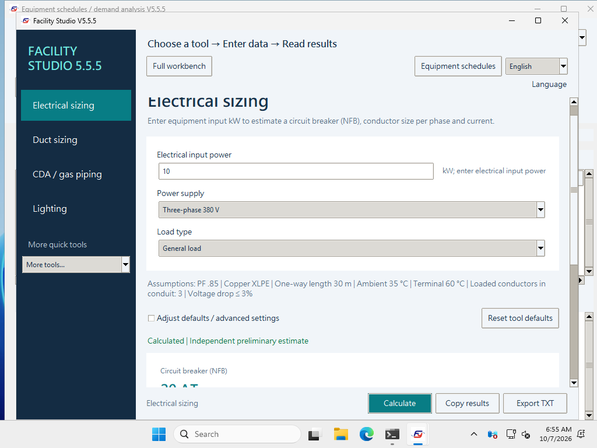
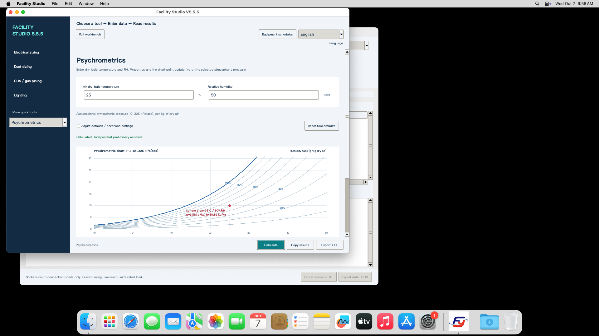

# V5.5.5｜繁體中文 / English

[English](2026-10-07-bilingual.en.md) · [文件中心](README.md) · [目前下載](../README.md#下載)

主畫面右上角選擇 **English** 或 **繁體中文**。已開啟的完整工程工作台、單台空調箱與設備表視窗會同步更新；不需重新輸入數字或重開軟體，下次啟動會記住語言。

Select **English** in the top-right language selector. Open workbench, AHU and equipment windows update together; your inputs stay in place. The choice is remembered on restart.

## 翻譯範圍 / Translation coverage

- 七種獨立工具、完整工作台、空調箱逐段設定及設備表分析。
- 欄位名稱、下拉選項、單位說明、採用條件、驗證錯誤及操作提示。
- 空氣線圖標籤、工作台圖表、TXT／HTML 報告。
- 新匯出的 Excel／CSV 設備範本，包括標題、說明及選項；中英文範本都可匯入。

**工程資料保持原樣：**語言只影響顯示文字。已填數值、單位基準、公式、判斷邏輯與專案格式保持一致；自填設備名稱、工程案名及備註保留原文。舊中文專案與設備表可繼續使用。切換不會讓無效輸入恢復成舊的可匯出結果。

**Engineering data stays unchanged:** display text is translated; input values, units, formulas, validation rules and project formats remain consistent. User-entered names and notes retain their original language. Existing Chinese projects and equipment schedules remain readable. Invalid inputs continue to block result export after switching.

## 20 種中英數值一致性情境

每個平台的 `tests/bilingual.py` 檢查下列 20 種條件：中英文計算結果、輸入資料及報告中的數字集合須一致。

| # | 工具 | 條件 |
| --- | --- | --- |
| 1 | 電力 | 三相一般負載預設值 |
| 2 | 電力 | 單相 220 V、5 kW、連續運轉、PF 1 |
| 3 | 電力 | 30 kW 馬達、環境 45°C |
| 4 | 風管 | 預設風量與流速 |
| 5 | 風管 | 2,000 CFM、啟用路徑檢查、300 Pa |
| 6 | 風管 | 零風量 |
| 7 | CDA | 預設壓力與標準流量 |
| 8 | N2 | 100 Sm³/h、600 kPa(g) |
| 9 | 照明 | 預設燈具與空間 |
| 10 | 照明 | 90 m³、淨高 3 m，換算 30 m² |
| 11 | 照明 | 30 m²、500 lux，依型錄流明反算燈數 |
| 12 | 冷熱水 | 已知水量預設值 |
| 13 | 冷熱水 | 已知 100 kW、ΔT 5°C |
| 14 | 空氣狀態 | 預設溫濕度 |
| 15 | 空氣狀態 | 35°C、70%RH |
| 16 | 空氣狀態 | 大氣壓 80 kPa(abs) |
| 17 | 空氣狀態 | 0%RH 乾燥邊界 |
| 18 | 單位換算 | 預設風量換算 |
| 19 | 單位換算 | 5°C 溫度差，無絕對溫度偏移 |
| 20 | 單位換算 | Kv 10 與 Cv 換算 |

兩份原始碼各通過 **3,502 項檢核**，包含動態欄位翻譯、語言偏好保存／重新載入、七系統英文 Excel／CSV 匯入、舊中文範本相容、完整工作台與空調箱報告、HTML 語言屬性，以及自填中文名稱／HTML 特殊字元保留。這些是本版的語言與資料一致性測試；既有數值、設備分組及匯入安全回歸也保留。

## 原生交付檔驗收 / Native delivery verification

| 交付平台 | 原生環境 | 每次 GUI 驗收 | 證據 |
| --- | --- | --- | --- |
| Windows EXE／ZIP | Windows Server 2022 x64 | 82 項通過 | [JSON](evidence/v5.5.5-win-2022.json) |
| 同一份 Windows EXE／ZIP | Windows Server 2025 x64 | 82 項通過 | [JSON](evidence/v5.5.5-win-2025.json) |
| macOS Universal App／ZIP／DMG | Apple Silicon macOS 15.7.9 | 74 項通過 | [JSON](evidence/v5.5.5-mac-arm64.json) |
| 同一份 macOS App／ZIP／DMG | Intel macOS 15.7.9 | 74 項通過 | [JSON](evidence/v5.5.5-mac-intel.json) |

Windows 分別執行單檔、ZIP 解壓縮及中文路徑下的 EXE；外部 Python 已移出 PATH，EXE 對外連線被封鎖，七種快算、設備表與完整工作台仍通過。macOS 通過深度完整性簽章、原生 Tk Aqua、NumPy／Pillow、Matplotlib、冷啟動、Launch Services，以及 ZIP 與掛載 DMG 的實際執行。

發布採用的原生流程：[Windows](https://github.com/azx4121/facility-studio/actions/runs/37583708397)、[macOS](https://github.com/azx4121/facility-studio/actions/runs/37584093485)。Windows 標籤指向 `68f2815`，macOS 標籤指向 `f7294a4`；後者包含 Mac 診斷時間記錄，兩者的使用者計算與翻譯功能一致。

| 公開下載檔 | SHA-256 |
| --- | --- |
| Windows EXE | `746e967e0889295e7638bd11649f40d753873f19e43923c0a664e49a4d72dff3` |
| Windows ZIP | `d1fe13a1adb3d6e228209dd83c90735d4ce11e5262baa1ba1dc261d6f5378645` |
| macOS DMG | `b249b8272928fa35d092a634e6d4d06a17725d765a3fe46c7f5aba53d72acfd3` |
| macOS ZIP | `9b3f66d5fe937fea7457ebc963c48ce87a5f21ac540371436cc4c887c4308796` |

公開發布後另下載四份交付檔的完整位元組，SHA-256 均與各 Release 的 `SHA256SUMS.txt` 和 GitHub 資產 digest 一致。兩份 ZIP 通過 CRC 檢查；Windows ZIP 內的 EXE 與單檔下載相同，Mac bundle 版本、啟動檔與雙語原始碼齊全。見 [公開下載檔檢核](evidence/v5.5.5-public-packages.json)。

以下為原生驗收的真實英文介面，非示意圖：

本版修正小螢幕的啟動視窗與底部按鈕位置，並修正 macOS 原生按鈕忽略深色背景造成的低對比側欄；快算與完整工作台使用可控背景的 ttk 按鈕，驗收檢查文字／背景對比。診斷啟動失敗會寫入記錄並退出，不會等待無人操作的錯誤對話框。Windows 原生縮放檢查會等視窗管理器完成佈局，再按原本的螢幕邊界判定；越界或未顯示的按鈕仍會使驗收失敗。

macOS 診斷將兩次初始 GUI 佈局與後續操作分開：初始事件處理上限 20 秒，後續每輪事件處理仍限 5 秒，實際耗時記錄在 `Native_UITiming.json` 及驗收 JSON。這不是整個程序啟動時間的保證，首次字型快取建立另可能增加載入時間。數值、翻譯、簽章及交付檔驗證條件保持不變。

Hosted acceptance confirms the tested machines and delivered files. It does not establish compatibility with every end-user device. Windows 10/11 are support targets; native hosted checks use Windows Server 2022/2025 x64. macOS checks use Apple Silicon and Intel macOS 15. Other OS versions, physical keyboard behavior, Retina rendering and enterprise policies require device testing.

Windows 尚無商用 Authenticode 簽章；macOS 使用 ad-hoc 完整性簽章，未使用 Developer ID／Apple 公證。下載與首次開啟方式見 [中文首頁](../README.md) 或 [English quick start](../README.en.md)。

本版延續既有安全、macOS 執行環境及離線 Windows 修正；歷史提交、Release 和資產保留，授權保持不變。

