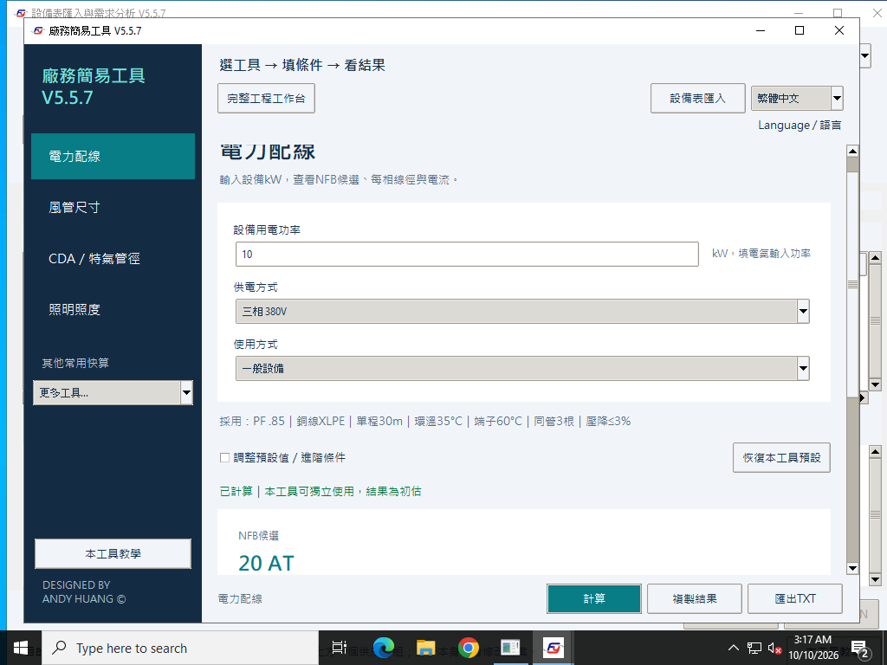
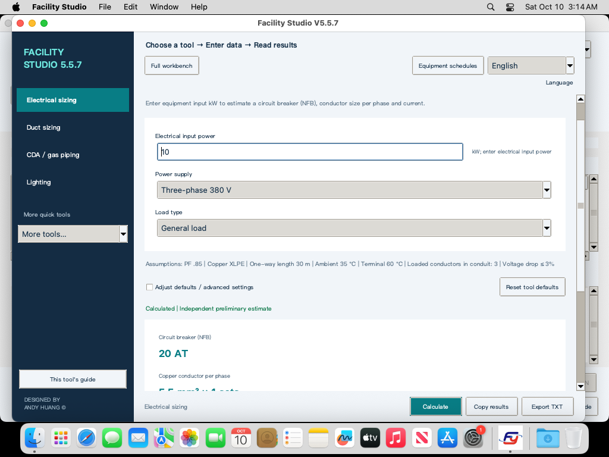

# Facility Studio V5.5.7 原生驗收與發布

核對時間：2026-10-10T11:28:30.709889+08:00。公開測試版：Windows `v5.5.7-win.1`、macOS `v5.5.7-mac.1`。

來源提交：[`a80a570a86f9edc43253ea99f24f9963ce769943`](https://github.com/azx4121/facility-studio/commit/a80a570a86f9edc43253ea99f24f9963ce769943)；來源 tree：`e9420ec0b98a66e270a4921dfa0e82a489224f26`。初次交接修正提交為 `e2146b38b2094d0b8c31b189d92e4c1c11813cec`，完整重建 tree `ce6ec209d9ca564e8ba46db4b57cce5a4c1243af`；後續教學格式修正另以提交保留。

本版修正最大馬達啟用、停用電熱效率及空調箱停用設備報告／選用額定電力，保留原始草稿與重新啟用驗證。詳細原因、範圍及來源測試見[停用欄位修正](2026-10-09-v5.5.7-inactive-fields.md)。

| 原生環境 | 驗證結果 | Actions |
| --- | --- | --- |
| Windows Server 2022 x64 | 每種執行 132 項通過：實際 Tk GUI、獨立 EXE／ZIP／中文路徑；前兩種移除外部 Python 並封鎖 EXE 對外連線 | [Windows build / verify](https://github.com/azx4121/facility-studio/actions/runs/38019795504) |
| Windows Server 2025 x64 | 同檔再次完成三種執行，每次 132 項 GUI／離線驗收通過 | [相同 Windows 流程](https://github.com/azx4121/facility-studio/actions/runs/38019795504) |
| Apple Silicon macOS 15 | 每次 124 項通過：Universal App、ad-hoc 深度完整性簽章、Tk Aqua、解壓 App 與掛載 DMG 執行 | [macOS build / verify](https://github.com/azx4121/facility-studio/actions/runs/38019795478) |
| Intel macOS 15 | 同一份 ZIP／DMG 簽章、原生 GUI 與掛載執行通過，每次 124 項 | [相同 macOS 流程](https://github.com/azx4121/facility-studio/actions/runs/38019795478) |

來源新增檢查每平台 970 項：24 種主案、48 種單機、256 種壓損組合，批次突變停用欄位並比對完整輸出與報告。原生交付另跑確定性輸出檢查與 6 個真實 Tk 互鎖操作。每平台原有回歸 52 情境／1,247 項獨立檢查，雙語 20 情境／3,883 項檢查，教學 20 情境／87 項檢查。檢查數與情境數分別列示。

首次原生流程在英文教學報告的行尾格式比對失敗，尚未建置或發布交付檔。已使驗證器與教學產生器使用相同行尾正規化並新增兩份 AHU 報告比對。CRLF／行尾空白對照通過；把報告 7.870 kW 改為 7.871 kW 則兩套來源皆拒絕。所有工程數字及內文仍完整比對。

公開 Release 僅含 EXE／DMG 與各平台 `SHA256SUMS.txt`；完整 ZIP 只用於原生驗收。發布器在兩個原生環境通過後，核對上傳大小及 GitHub SHA256 才公開。

| 交付檔 | SHA256 |
| --- | --- |
| [Facility_Studio_V5_5_7_Windows_Offline.exe](https://github.com/azx4121/facility-studio/releases/download/v5.5.7-win.1/Facility_Studio_V5_5_7_Windows_Offline.exe) | `4053ed6fcb5e0b0a7d5b726602635c828c2ed50602b826422b6c256f8fc3bcc8` |
| [Facility_Studio_V5_5_7_macOS_mac1.dmg](https://github.com/azx4121/facility-studio/releases/download/v5.5.7-mac.1/Facility_Studio_V5_5_7_macOS_mac1.dmg) | `5fc8097548d1ba6bfe6c3a0e5d4f4077c1e399d532f9e2e3924c5c233e56447d` |

[Windows Release](https://github.com/azx4121/facility-studio/releases/tag/v5.5.7-win.1) · [macOS Release](https://github.com/azx4121/facility-studio/releases/tag/v5.5.7-mac.1) · [可機讀驗證摘要](evidence/v557-native-release.json)。Actions 中完整 native/source artifacts 保留 14 天；這份摘要與來源測試保存在倉庫中。

本版實際原生畫面（保留署名與教學入口）：

現有提交、標籤、Release、ANDY HUANG 署名與 PolyForm Noncommercial／Internal Business Use Additional Permission 授權保留。Windows 尚無 Authenticode，macOS 使用 ad-hoc 簽章，沒有 Developer ID／公證；此次沒有解決作業系統的發行者信任提示。

## English

V5.5.7 passed native build and GUI acceptance on Windows Server 2022/2025 x64 and Apple Silicon/Intel macOS 15. The same delivered files were rechecked on each second environment. Windows EXE/ZIP execution removes external Python from PATH and blocks outbound EXE traffic; Unicode paths are checked separately. Mac acceptance verifies the Universal App's ad-hoc signature and executes both extracted and DMG-mounted apps. The release publisher checks uploaded size and SHA256 before making a release public.

Each source distribution passed 970 inactive-output/report checks, 52 regression scenarios / 1,247 independent checks, 20 bilingual scenarios / 3,883 checks and 20 tutorial scenarios / 87 checks. Tutorial comparison canonicalizes only line endings/trailing whitespace; changed report numbers are rejected. Native bundles additionally exercise the actual Tk interlocks. Public assets are EXE/DMG plus platform checksums; internal ZIPs and historical releases remain distinct.

This is hosted-runner acceptance, not proof of every Windows 10/11 or macOS 11+ device, beta OS, enterprise policy or physical keyboard. Windows publisher signing and Apple Developer ID/notarization remain unconfigured. Engineering results remain preliminary estimates.
