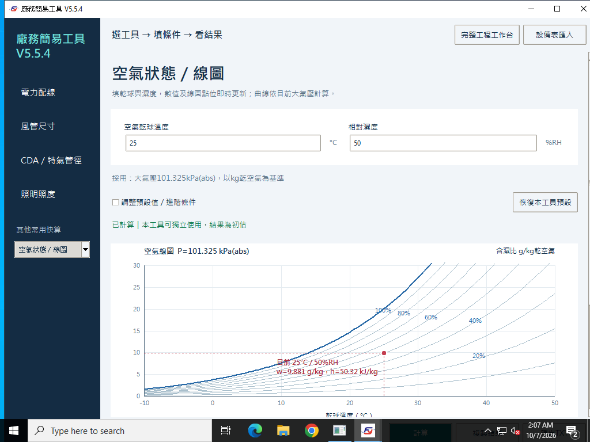

# 空氣線圖計算機：乾球、RH、濕球、露點、焓與含濕比

[回到工具指南](README.md) · [下載](../../README.md#下載)

**Psychrometric calculator with a live humidity-ratio chart.** 開啟「其他常用快算 → 空氣狀態／線圖」，填乾球°C與相對濕度%RH，數值與對應點位即時更新。進階大氣壓預設101.325 kPa(abs)，可依當地壓力調整；曲線跟隨目前壓力。快算入口是乾球＋RH；完整工作台另有其他空氣狀態組合。

## 案例12：35°C、70%RH、101.325 kPa(abs)

| 空氣性質 | 結果 |
| --- | --- |
| 含濕比 | 25.159 g/kg乾空氣 |
| 焓 | 99.771 kJ/kg乾空氣 |
| 露點 | 28.701°C |
| 濕球 | 30.059°C |
| 比容 | 0.90827 m³/kg乾空氣 |

公式：`Pw=RH/100×Pws(T)`；`w=0.621945×Pw/(P−Pw)`；`h=1.006T+w(2501+1.86T)`。P與Pw必須使用相同單位，w在焓公式中用kg/kg乾空氣，不能直接代入g/kg。

## 案例13：25°C、50%RH、大氣壓80 kPa(abs)

進階大氣壓改80。含濕比12.568 g/kg乾空氣、焓57.167 kJ/kg乾空氣、露點13.864°C、濕球17.332°C、比容1.09139 m³/kg乾空氣。相同乾球／RH下，水蒸氣分壓相同；含濕比及比容會隨總壓變化，不能全採海平面數值。

RH=0%時不存在有限露點，軟體不以假數值代替。冬夏盤管容量還需要乾空氣質量流率及進出口狀態；單一空氣點不能推得空調總負荷。

以下是Windows原生驗收的實際畫面，顯示預設25°C／50%RH；不是上方35°C案例的截圖：

案例輸入：[12](../examples/12-air.json)、[13](../examples/13-air.json)。反算另以Buck飽和水蒸氣壓關聯式核對含濕比／焓，容許0.3%近似差異，見[記錄](../examples/calculation-results-windows.json)。
