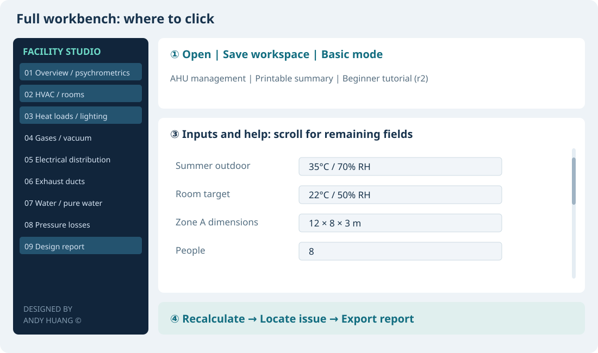

# Full workbench: a beginner walkthrough

[繁體中文](workbench.md) · [Download the app](../../README.en.md#download-and-run) · [Tool guides](README.en.md) · [Offline tutorial package](https://github.com/azx4121/facility-studio/raw/refs/heads/main/docs/tutorial/Facility_Studio_Beginner_Tutorial.zip)

For **V5.5.7 on Windows and macOS**. Finish sections 1–6 to produce your first practice report. Sections 7–9 are optional extensions. All examples use synthetic data, with no client or company project information.

## 1. Choose the right starting point

| Your task | Entry | Do you need the full workbench? |
| --- | --- | --- |
| kW to current, NFB and conductor candidate | Electrical sizing on the home screen | No |
| A duct, CDA pipe, lighting, water or air-state calculation | The corresponding simple calculator | No |
| Room HVAC, heat loads, utilities and a project report | Full workbench | Yes: start at section 3 |
| One unit's preheat, precool, humidification, recool and reheat | AHU management inside the workbench | See section 8 |
| Batch Excel/CSV equipment demand | Import equipment schedule | Independent analysis; results do not silently populate the main project |

**Do not start by filling every tab in an empty project.** Open a practice project, change one condition, observe the result, then replace the example with your site data.

Extract the tutorial ZIP, then open `START_HERE.html` in a normal browser. It supports Chinese/English, step-by-step navigation, progress checkboxes and printing. The tutorial and practice files require neither Python nor an internet connection; external GitHub links need internet. Checkmarks record reading, not software acceptance. Progress counts only the first six required steps; extensions are optional. Read-all mode disables the single-step checkbox to avoid recording the wrong chapter. V5.5.6 includes in-app offline help: **This tool's guide** follows a simple calculator, and **Beginner tutorial** guides the full workbench. Older binaries can use the HTML directly.

## 2. Learn four locations on the screen

This is a **location diagram based on actual controls, not a GUI screenshot**.

| Location | Controls to learn first | Purpose |
| --- | --- | --- |
| Top | Open, Save workspace, Save as, Duplicate as new scheme, Basic mode | Open the example and retain the main project and AHUs |
| Left | 01, 02, 03, 09 | Shared climate → HVAC/rooms → heat loads → report |
| Center | Input fields, help text and page scrollbars | Scroll smaller windows to reach the remaining fields |
| Bottom | Recalculate, Locate issue, Export Design report | Recalculate first, locate a problem, then export current results |

**Basic mode hides less-used fields but still uses the saved effective settings.** Disabled or hidden fields do not mean data has been deleted. Values disabled by a control mode remain as drafts and are excluded from that mode's calculation. Each page discloses retained reference settings and sources. Basic navigation starts with HVAC and heat loads; choose All engineering pages to reveal the other systems. Collapsing navigation preserves saved demand. Advanced mode lets you inspect individual adopted values. **Apply page reference values** changes that page's reference settings; leave it alone during the walkthrough. **Undo import** can restore the previous import/preset operation.

## 3. Open the first practice project

1. Download and completely extract the [tutorial package](https://github.com/azx4121/facility-studio/raw/refs/heads/main/docs/tutorial/Facility_Studio_Beginner_Tutorial.zip). Do not operate inside a ZIP preview.
2. Locate `01_Practice_AHU.json`. You can rename the working copy with the in-app Save as action after opening it.
3. Open Facility Studio → **Full workbench** → **Open** at the top.
4. Select `01_Practice_AHU.json`. Save an existing modified project before switching. Use Save as to write `My_First_Project.json`; subsequent Save workspace actions use that new path.
5. Select **Basic mode**, then click **Recalculate** at the bottom, or press F5.

This example is a **12 × 8 × 3 m general work area, 8 people, AHU outside/return-air mixing**. It is not a cleanroom certification case or a product selection. Unused gases, PV, exhaust, PCW and pure-water demand are zero; other equipment and chilled-water assumptions are provided for practice.

**Successful practice means “Calculation complete,” while engineering assessment remains “Data required.”** Valid calculation, pending evidence and failed conditions are different outcomes; calculation alone does not certify the design. Manufacturer performance, equipment pressure losses and electrical review are deliberately pending. Do not invent data to turn this into a passing selection.

## 4. Start your own project with five input groups

| Page / input | Example | What to enter for your project |
| --- | --- | --- |
| 01 Shared climate: summer outdoor / room target | 35°C, 70% RH / 22°C, 50% RH | Actual design climate and room requirements; winter example is 8°C, 70% RH |
| 02 HVAC/rooms: system / A-zone dimensions / people | Mixed AHU / 12, 8, 3 m / 8 people | Actual architecture, dimensions in m; unused zone B retains zero length, width and people |
| 02 Airflow calculation / ACH / specified outside air | ACH / 6 per hour / 0 for automatic | ACH is circulation demand, **not all fresh air**; 6 is a practice assumption, not a general requirement |
| 03 Equipment heat / operating rate / process moisture | 5 kW / 100% / No additional moisture | Heat for the same room boundary; use “Unknown” when moisture is not established |
| 03 Lighting / wall and floor areas | 500 lux, 4000 lm and 40 W per fixture / 60 and 96 m² | Lux is the target; lumens belong to each fixture; areas are m², not m³ |

On page 01, climate inputs appear before the chart. Edit shared climate also locates the fields. Utilization 0.6, maintenance 0.8 and person sensible/latent gains of 75/55 W are preliminary assumptions. In this example the summer adjacent-floor temperature is 22°C, equal to the room, so summer floor transmission is zero. This advanced assumption also affects the result.

**Try one change:** set A-zone people from 8 to 12 and recalculate. Person sensible heat should increase by **0.300 kW**, and latent heat by **0.220 kW**. Then restore 8 and recalculate. Changing one input at a time makes the links easier to understand.

## 5. Check this short result table first

After restoring the original data, compare the summaries on pages 01/03 and the page 09 report:

| Item | Expected result | Meaning |
| --- | --- | --- |
| Area / volume | 96 m² / 288 m³ | 12 × 8; area × 3 m |
| Lighting | 25 fixtures / 1.000 kW | 4000 lm and 40 W each, count rounded upward |
| Room sensible heat | 7.870 kW | Equipment 5 + people 0.6 + lighting 1 + wall 1.270; other example gains are zero |
| Room latent heat / moisture | 0.440 kW / 0.633 kg/h | 8 × 55 W; no additional process moisture in this example |
| Minimum make-up outside air | 192.0 CMH, room basis | 8 × 24 CMH/person for this example, not a general ventilation rule |
| Circulation / treated airflow | 1728.0 / 2400.2 CMH, room basis | 288 × 6 sets a circulation minimum; heat/moisture balance needs more airflow |
| Linked CHW flow | 41.115 LPM | Water-side load including 10% allowance, ΔT 5 K; not the stored manual 400 LPM |
| UP preliminary distribution | 8.937 A; NFB candidate 15 AT; 3.5 mm² per phase, one set | Separately entered 5 kW electrical input, 380 V, PF 0.85; electrical review remains pending |

Begin with three formulas: `area=length×width`; `circulation CMH=volume×ACH`; `fixture count=ceil(target lux×area/(fixture lumens×utilization×maintenance))`. The full report also states thermal, moisture and piping formulas.

The overview's **Process-chart season** switches summer/winter. Horizontal axis: dry bulb °C; vertical axis: humidity ratio g/kg dry air. OA is outside air, RA room air, IN inlet, C1/C2 cooling coils, HT heating and SA supply. Plotted points are **required or specified states**, not proof that unselected installed equipment achieves them. Bypassed stages can overlap; this is not a missing point.

## 6. Save and export your first report

1. Use **Save workspace** for `My_First_Project.json`. **An opened project saves back to the same file.** Save as changes the path and retains project identity. Duplicate as new scheme saves a new file and project identity while preserving the original. Cancelling file selection leaves the active case unchanged.
2. Select **09 Design report**. Read conditions, results, pending data and formulas.
3. **Export Design report** at the bottom writes a **TXT** file.
4. **Export printable summary** at the top writes **HTML**. Open it in a browser and print, choosing **Save as PDF** if needed.
5. **Save full calculation data JSON** on page 09 exports numerical audit results. **It is not a reopenable workspace JSON.**

| File | Purpose | Open from the workbench? |
| --- | --- | --- |
| Saved workspace `.json` | Main project, all AHUs, A/B, sources and transfer receipts | Yes |
| Exported TXT / HTML / PDF | Read, print or share results | No |
| Full calculation JSON | Numerical review and calculation evidence | Not as a workspace |
| Saved single-AHU JSON | One AHU's settings | Open in the AHU window; the main entry also routes it to an independent AHU without replacing the workspace |

**Your first practice report is now complete.** Learn this route before adding the optional systems below.

## 7. Use other pages only when needed

In Basic mode, choose All engineering pages to reveal utilities. For one calculation, use the corresponding simple tool. Its Tool tutorial button opens the matching offline chapter.

| Sidebar page | When to use it | First checks |
| --- | --- | --- |
| 04 Gases/vacuum | CDA, N2, other gases or PV | **Flow**, minimum pipe pressure, units; advanced mode supports per-line pressure/velocity |
| 05 Electrical distribution | UP/NP demand estimates | Electrical-input kW, three-phase line voltage and load type; electrical input is separate from room heat |
| 06 Exhaust ducts | General, acid, alkali, organic or hot exhaust | CMH per line; review preliminary speed/allowance against actual materials and requirements |
| 07 Water/pure water | Cooling/heating water or pure-water main | Flow source and ΔT; pure-water circulation LPM and velocity limit |
| 08 Pressure losses | A known critical route | An active system, route length, fitting allowance and whether equipment loss is known |

Unused gases, PV, exhaust, PCW and pure water can stay zero in this example. **Water circuits serving the active HVAC system remain linked to its load.** Do not zero an active circuit just to hide a page.

**Latent load:** removal demand caused by moisture entering the room, distinct from ordinary machine heat. People are calculated automatically. An open tank evaporating 1 kg/h into the room adds `1×2501/3600=0.695 kW`; choose **Known moisture generation (kg/h)** and enter 1. If the known value is 1 kW, choose **Known latent load (kW)** instead. Only the selected mode is used. Outdoor moisture is handled at the coil, not entered again as room process moisture. Unknown process moisture is excluded pending data and may understate dehumidification demand. It is not a conservative allowance.

**Linked water flow:** the linked mode calculates `LPM=60000×kW/(ρ×cp×ΔT)` and excludes stored manual flow. To use a measured 100 LPM, select **Independent input** before entering 100. Capacity is then compared with demand. Upstream PCW heat removal and the main's flow boundary must also agree. MCHW, CHW, DCCW, PCW and HW each support independent fluid properties; transferring clean-water assumptions for one adopted loop does not overwrite the other loops.

**Simple pressure loss:** select CHW → route length 30 m → 30% general preliminary allowance → equipment data unavailable. Water-side length is the **sum of supply and return straight runs**. **Closed circulation does not add building height as pump static lift.** Unknown equipment losses leave a pipe-only subtotal; this is not full pump selection head. The 10/30/50% choices are scenario allowances, not fitting standards. Check Pa/mmAq versus kPa/water head before combining losses.

**CDA/PV:** pressure and velocity cannot uniquely size a pipe without flow. Gas sizing defaults to the shared **minimum gauge pressure**, distinct from supply pressure. PV Torr/kPa(abs)/mbar(abs) are absolute; unit switching converts the value. Pure-water resistivity is a reference target at 25°C, not measured quality certification.

## 8. AHU management: use the second practice project

`02_Practice_MAU_and_AHU.json` already includes a main project and **Tutorial MAU-01**, so you need not start with the large 58,000 CMH default unit. It is a full-outside-air MAU+FFU+DCC teaching model for the same 96 m² area, with 20 ACH circulation. Supply-state single-unit airflow is about 358.3 CMH; room-basis airflow is about 359.2 CMH. The small difference comes from state/specific-volume bases.

1. Save the first project. Open practice copy loads the second example with a new project identity. Alternatively open the second JSON and use Save as.
2. **Recalculate** the main project, then open **AHU management**.
3. Select **Tutorial MAU-01** → **Open selected AHU**. Do not add a new large default unit first.
4. On **1 Design conditions**, inspect airflow, summer/winter conditions/targets, H1/H2 sources, C1/C2 water temperatures/candidate capacities and humidifier type.
5. All stages initially use automatic demand. H1/H2 each have 8 kW electric heat, C1/C2 each 3 US RT, with wet media operating only when humidification is needed. **These are synthetic practice ratings**; manufacturer curves, resistance and media data remain pending.
6. Recalculate, switch summer/winter in the results, and inspect each inlet/outlet, demand and rating check. Demand states do not simulate actual leaving air from undersized equipment.

| Stage | Function | Start with |
| --- | --- | --- |
| H1 preheat | Initial heating, possibly needed for downstream evaporative humidification | Automatic demand; select actual electric, recovered hot water, combined or disabled sources |
| C1 precool | First cooling stage | Automatic demand; review supply/return water and candidate RT |
| Humidification | Evaporative wet media or steam | Actual equipment type; water/energy effects differ |
| C2 recool | Further cooling or dehumidification | Automatic demand; water temperature must support the target humidity ratio |
| H2 reheat | Final supply dry-bulb adjustment | Automatic demand; review this stage's installed capacity separately |

For stage outlet targets, enable **Show advanced / manufacturer data**, then choose a summer/winter stage's specified outlet dry bulb. Cooling stages also offer specified T/RH. **Each inlet follows the preceding outlet**, rather than restarting at outdoor conditions. Use bypass for an unused stage, not 0°C.

**Main → AHU:** **Import main-project seasonal supply demand** shows a confirmation. It currently supports **full-outside-air MAU main projects only** and asks for the unit service share (for example, 50% for each of two units); the first mixed-AHU example cannot be imported into this full-outside-air unit model. It updates seasonal inlet/supply demand and chilled-water temperatures. Explicit stage targets and installed ratings remain and require recalculation. Changing the main boundary expires the old link; reimport it.

**AHU → main:** use **Preview water / rated-power transfer**, read before/after values, then confirm. This example previews MCHW **12.443 LPM**, CHW **12.348 LPM**, NP fan **0.370 kW**, heating **16.000 kW**, and confirmed wash pump **0.100 kW**. Heating 16 kW is the sum of installed heater ratings, **not concurrent air-heating demand**.

Demand ledger records explicitly included sources. **Returning the same AHU ID updates that source; different units add.** On first transfer, confirm whether existing electrical or gas values represent other equipment. No rebuilds those targets from included sources, avoiding double counting. Unknown pump or steam input leaves a known-power subtotal with pending data.

Water circuits merge only at matching supply/return temperatures, fluid and service group. Design flow is `max(sum of summer, sum of winter)`, not a sum of individual seasonal maxima. Incompatible circuits remain separate; one main hydraulic row can adopt only one selected circuit. The others remain in the report. Electrical design retains P/Q, source design allowances and a branch-current floor. A/B alternatives must not be included as concurrent installed units. Transfer does not certify manufacturer performance.

Closing an AHU window retains the unit. Save the whole workspace from the main window. **Save single AHU** writes a separate unit file. Read the [larger stage-capacity worked example](ahu.en.md) next if needed.

## 9. Sources, A/B comparison and recovery

**Sources / comparison / recovery** contains three tabs:

| Tab | Use |
| --- | --- |
| Parameter sources | Identify assumptions, measurements and manufacturer documents, with selection/catalog references |
| A/B scenarios | Recalculate and capture A; change one input, recalculate and capture B; compare. Captured snapshots do not automatically update after further edits |
| Backups and calculation basis | View recovery; automatic recovery runs about every 30 seconds and does not replace deliberate saving |

Resaving an existing project preserves a `.json.bak`. An exported calculation result is not a project backup. Keep the workspace, not only a TXT report. Invalid inputs can be saved as a draft; they do not thereby become valid report inputs.

## 10. When you get stuck

| Problem | Next action |
| --- | --- |
| Shared temperature/humidity fields are missing | On 01, climate inputs precede the chart; Edit shared climate also locates them |
| A field is hidden/disabled | Check basic/advanced and control modes; inactive values are retained, not deleted |
| Editing shows Recalculation required | The last valid plot/report remains for comparison, marked stale with export/transfer disabled. Correct inputs and recalculate for current results |
| Red input outline or export disabled | Locate issue, fix that field/unit and recalculate; do not reuse an old report |
| Data required | Read what is missing; preliminary calculation does not certify product selection |
| Conditions not met | Inspect the capacity, temperature or flow limitation; increasing a safety allowance alone is not a repair |
| Process moisture unknown | Choose the unknown mode and retain pending data rather than guessing a large kW |
| PCW removal exceeds equipment heat | Recheck common operating boundary, unit count, flow, ΔT, operating rate and exhaust share |
| Manual water flow has no effect | Linked mode ignores it; choose Independent input for measured flow |
| Mixed AHU cannot link to the unit | The full-outside-air unit model supports MAU links; do not change a real system's architecture just to bypass this restriction |
| Transfer says the source expired | Reimport current main demand; detach only for a deliberate independent design |
| You only need one calculation | Return to the simple calculator instead of filling a whole facility |

Practice verification runs **20 operation-related conditions per source platform**, including heat/moisture conservation, units, water ownership, pressure-loss scope, MAU linking and insufficient capacity. See [inputs, verifier and evidence](../tutorial/README.md). Control locations were checked against source. Native acceptance of the new tutorial entry and author credit is tracked separately; numerical checks are not described as manual testing of every UI control.

For remaining problems, [report an issue](https://github.com/azx4121/facility-studio/issues) with version, platform, page, steps and synthetic input. Formal product/protection selection needs site conditions and manufacturer data. Use remains governed by the [current license guide](../../LICENSE_GUIDE.en.md), including the internal engineering-work permission.
