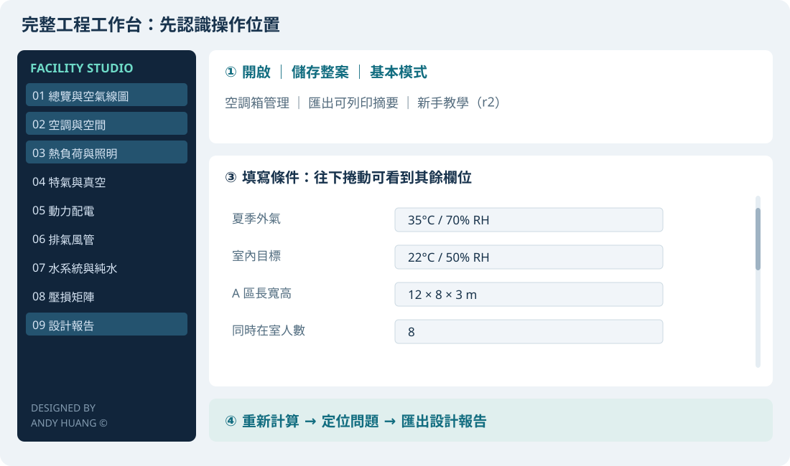

# 完整工程工作台：新手跟做教學

[English](workbench.en.md) · [下載軟體](../../README.md#下載) · [工具指南](README.md) · [離線教學懶人包](../tutorial/Facility_Studio_Beginner_Tutorial.zip)

適用 **V5.5.5 Windows／macOS**。先完成第 1～6 節，就能做出第一份練習報告；第 7～9 節是需要時才使用的延伸操作。這份教學使用合成資料，不含任何業主或公司專案。

## 1. 先選對入口

| 您今天要做什麼 | 使用入口 | 需要完整工作台嗎？ |
| --- | --- | --- |
| 只算 kW → 電流／NFB／線徑 | 主畫面「電力配線」 | 不需要 |
| 只算風管、CDA、照度、水量或空氣狀態 | 對應的簡易工具 | 不需要 |
| 整理整個空間的空調、熱負荷、廠務及報告 | 「完整工程工作台」 | 需要，從本教學第 3 節開始 |
| 比較單台箱的預熱、預冷、加濕、再冷、再熱 | 工作台上方「空調箱管理」 | 看第 8 節 |
| 整批設備 Excel／CSV 彙總 | 「設備表匯入」 | 可獨立使用；分析結果不會默默填入主案 |

**第一次不要從空白案件填完所有分頁。** 先開練習案、只改一個條件、觀察結果，再換成自己的現場資料。

離線包解壓縮後，雙擊 `START_HERE.html`：用一般瀏覽器閱讀，可切換中英文、逐步跟做、勾選進度或列印。教學及練習不需要 Python，也不需要連網；GitHub 外部連結需要網路。程式內的「新手教學」按鈕從 **win.2／mac.2 修訂**起提供，較早的 V5.5.5 請直接開啟離線 HTML。

## 2. 工作台只要先認識四個位置

這是按實際控制項整理的**位置示意圖，非 GUI 截圖**。

| 位置 | 先學這些按鈕 | 用途 |
| --- | --- | --- |
| 上方 | 開啟、儲存整案、基本模式 | 開練習案，保留主案及單機資料；初學先用基本模式 |
| 左側 | 01、02、03、09 | 共同氣候 → 空調與空間 → 熱負荷 → 報告 |
| 中間 | 欄位及其說明、頁面捲軸 | 短頁面向下捲，不必一次看到所有欄位 |
| 下方 | 重新計算、定位問題、匯出設計報告 | 先重算，遇問題用定位，再輸出目前結果 |

**基本模式是把較少用的欄位收起來，仍採用已保存的有效設定。** 灰色或隱藏欄位不等於資料消失；模式停用的欄位保留草稿，但不參與該模式的計算。進階模式可以檢查採用值。「套用本頁初估係數」會變更本頁參考值；做跟練時先不用，誤按可用「復原帶入」。

## 3. 開啟第一個練習案

1. 下載並完整解壓縮 [教學懶人包](../tutorial/Facility_Studio_Beginner_Tutorial.zip)。請不要在 ZIP 預覽視窗內操作。
2. **複製** `01_Practice_AHU.json` 到桌面，改名 `My_First_Project.json`，保留原範例方便重來。
3. 開啟 Facility Studio →「完整工程工作台」→ 上方「開啟」。
4. 選擇剛剛複製的 `My_First_Project.json`。若現有案件未保存，先保存再切換。
5. 上方選「基本模式」，按下方「重新計算」，或按 F5。

本例是 **12 × 8 × 3 m 的一般作業區，8 人，AHU 外氣／回風混合**。不是無塵室認證案例，也不是任何產品的選型書。其他無需求的氣體、PV、排氣、PCW、純水設為 0；已有設備與冰水等初估資料供練習。

**跟練成功的狀態是「結果與報告已同步」，品質標示仍為「待補資料」。** 本例故意保留原廠性能、設備阻力及配電覆核待補，不應把它改成假資料只為取得通過。

## 4. 自己的案件先填這五組資料

| 頁面／欄位 | 本例輸入 | 您自己的案子如何填 |
| --- | --- | --- |
| 01 共同氣候：夏季外氣／室內目標 | 35°C、70%RH／22°C、50%RH | 採實際設計氣候與室內需求；冬季例為 8°C、70%RH |
| 02 空調與空間：空調系統／A 區長寬高／人數 | AHU (OA+RA 混合)／12、8、3 m／8 人 | 選真實架構，尺寸用 m；不用 B 區就保留長寬及人數為 0 |
| 02 風量計算模式／換氣次數／指定外氣 | ACH／6 次/h／0 自動 | ACH 是循環需求，**不是全部新鮮外氣**；6 是本例練習值，不是通用規定 |
| 03 設備發熱／運轉率／製程水氣 | 5 kW／100%／沒有額外產濕 | 設備熱用同一範圍的入室熱收支；不知道產濕就選「尚不清楚」，不當作已確認沒有 |
| 03 照度與燈具／外牆及樓板 | 500 Lux、4000 lm/盞、40 W/盞／60、96 m² | Lux 是目標，lm 是單燈光通量；面積用 m²，不填 m³ |

在 01 頁按「編輯共同氣候」會捲到溫濕度欄位。這些欄位放在總覽圖下方；不是只有圖而沒有設定。照明利用係數 0.6、維護係數 0.8、人員顯／潛熱 75／55 W 是本例的初估值。樓板鄰側夏季溫度在本例採 22°C，與室內相同，所以樓板夏季傳熱為 0；這個進階條件也會影響結果。

**動手一次：**只把 A 區人數 8 改成 12，再重算。人員顯熱應增加 **0.300 kW**，人員潛熱增加 **0.220 kW**。觀察後改回 8，重算再繼續。每次改一項，最容易理解連動。

## 5. 結果只先看這張表

回到原練習資料重算後，在 01 摘要、03 計算摘要及 09 報告核對：

| 項目 | 本例應得結果 | 怎麼理解 |
| --- | --- | --- |
| 面積／體積 | 96 m²／288 m³ | 12 × 8；面積 × 3 m |
| 照明 | 25 盞／1.000 kW | 每盞 4000 lm、40 W；盞數向上取整 |
| 室內顯熱 | 7.870 kW | 設備 5 + 人員 0.6 + 照明 1 + 外牆 1.270；其他本例為 0 |
| 室內潛熱／產濕 | 0.440 kW／0.633 kg/h | 8 人 × 55 W；本例沒有額外製程產濕 |
| 最低補償外氣 | 192.0 CMH，室內基準 | 本例由 8 人 × 24 CMH/人決定，不是通用通風法規 |
| 循環需求／實際處理風量 | 1728.0／2400.2 CMH，室內基準 | 288 × 6 是循環下限；熱濕平衡需要更高風量 |
| CHW 連動水量 | 41.115 LPM | 水側冷量含 10% 餘裕，ΔT=5 K；不是原手填 400 LPM |
| UP 盤初估 | 8.937 A；NFB 候選 15 AT；每相 3.5 mm² × 1 組 | 本例另外填了 5 kW 電力、380 V、PF0.85；仍待配電覆核 |

公式只先記三個：`面積=長×寬`；`循環CMH=體積×ACH`；`燈數=向上取整(目標Lux×面積÷(單燈lm×利用係數×維護係數))`。完整報告會列熱濕守恆及管路公式。

總覽圖下拉「流程圖季節」可選夏季／冬季。橫軸乾球 °C、縱軸含濕比 g/kg乾空氣；OA 外氣、RA 室內、IN 入口、C1／C2 盤管、HT 加熱、SA 送風。圖上的點是**需求或指定狀態**，不代表尚未選型的實體設備已能達到。某段旁通時點會重疊；它不是圖點遺漏。

## 6. 保存與匯出，完成第一輪

1. 按「儲存整案」保存目前 `My_First_Project.json`。**開啟過的案件會存回同一個檔案**；想另做一案，先在檔案總管／Finder 複製改名再開啟。
2. 點左側 **09 設計報告**，先看設計條件、結果、待補事項及公式。
3. 下方「匯出設計報告」輸出 **TXT**，適合傳送文字結果。
4. 上方「匯出可列印摘要」輸出 **HTML**；以瀏覽器開啟，再按列印，可選「另存 PDF」。
5. 如需數值追溯，09 的「另存完整驗算資料 JSON」另存計算結果。**它不是可重新開啟的整案 JSON**。

| 檔案 | 用途 | 可以用工作台「開啟」嗎？ |
| --- | --- | --- |
| 儲存整案的 `.json` | 主案、所有空調箱、A/B、參數來源與回傳記錄 | 可以 |
| 匯出的 TXT／HTML／PDF | 閱讀、列印、分享結果 | 不可以 |
| 完整驗算資料 JSON | 檢查數值與計算依據 | 不作為整案開啟 |
| 另存單機 JSON | 單台空調箱資料 | 在單機視窗「開啟」，不是主案入口 |

**到這裡就完成第一份練習報告。** 先熟悉這條路徑；需要其他廠務系統再往下學。

## 7. 其他分頁，需要時才填

| 左側頁面 | 何時用 | 最少先確認 |
| --- | --- | --- |
| 04 特氣與真空 | 有 CDA、N2 等氣體或 PV | **流量**、最低管內壓力、單位；進階可逐路改壓力和風速 |
| 05 動力配電 | 要估 UP／NP 盤需求 | 電氣輸入 kW、三相線電壓、負載類型；電力與設備熱是不同資料 |
| 06 排氣風管 | 有一般、酸、鹼、有機或熱排 | 各路 CMH；初估流速／餘裕可先沿用，之後依實際材質與需求核對 |
| 07 水系統與純水 | 要估冷熱水或純水主管 | 選水量來源、ΔT；純水填循環 LPM 和流速限制 |
| 08 壓損矩陣 | 已有最不利路徑，要估壓差 | 選有流量的系統、路徑長、管件餘裕及設備壓差是否已知 |

沒有需求的氣體、PV、排氣、PCW、純水，在本例保留 0 即可；**CHW 等服務正在運轉的空調水路仍由負荷連動計算**，不能為了隱藏頁面而隨意歸零。

**潛熱：**它是進入室內的水氣造成的除濕需求，跟機台散熱不是同一件事。人員會自動算；若開放水槽每小時蒸發 1 kg 進室內，選「已知產濕量 kg/h」填 1，就增加 `1×2501÷3600 = 0.695 kW` 的製程潛熱。若已知的是 1 kW 潛熱就選「已知潛熱 kW」。只採所選的一種，不兩種都加；外氣水氣另在盤管算，不再填成室內製程水氣。未知用「尚不清楚」保留待補。

**水量連動：**「連動負荷」用 `LPM=60000×kW÷(ρ×cp×ΔT)` 自動算，手填欄位不採用。要使用量測的 100 LPM，先選「獨立輸入」才填 100；模型會比較這個水量的冷熱容量與需求。上游 PCW 機台熱移除和主管流量來源也要一致。

**簡易壓損：**選 CHW → 路徑長 30 m → 一般初估 30% → 尚無設備資料。30 m 在水側是供、回直管加總；**閉式循環不把樓層高度直接當泵靜揚程**。設備壓差未知時只報管路小計，不能把它當完整選泵揚程。10／30／50%是方案餘裕，不是管件標準。風管壓差顯示 Pa／mmAq、水側可顯示 kPa／水頭，勿直接把不同單位的數字相加。

**CDA／PV：**只填壓力及流速不能求唯一管徑，還需要流量。氣體預設用共用的**最低表壓**定寸，與供氣表壓不同；PV 的 Torr／kPa(abs)／mbar(abs) 都是絕壓，切換會換算數值。純水電阻率是 25°C 參考目標，不是量測證明。

## 8. 空調箱管理：先用第二份練習案

第二案 `02_Practice_MAU_and_AHU.json` 已包含一個主案及 **Tutorial MAU-01** 單機，讓您不必從預設的 58,000 CMH 大箱開始。此案是全外氣 MAU＋FFU＋DCC 的教學模型，同樣 96 m²，循環需求採 20 ACH；供風及單機送風狀態約 358.3 CMH，室內基準約 359.2 CMH。兩個數字因狀態／比容基準不同而稍異。

1. 先保存第一案。複製第二案並改名後，從主工作台「開啟」。
2. 主案按「重新計算」，再按上方「空調箱管理」。
3. 選 **Tutorial MAU-01** →「開啟選取單機」，不要先新增一台大預設箱。
4. 在「1 設計條件」先看風量、夏冬外氣與目標、H1／H2 熱源、C1／C2 供回水及候選容量、加濕設備。
5. 本例各段先採「自動需求」，H1／H2 各配置 8 kW 電熱，C1／C2 各 3 US RT，濕膜只在需要加濕時運轉。**這些是合成練習配置**；原廠曲線、阻力及濕膜資料仍待補。
6. 按「重算」，在結果頁切夏季／冬季，對照每段入口、出口、需求與容量檢核；需求點不是設備不足時的實際出風模擬。

| 段落 | 作用 | 初學先怎麼設定 |
| --- | --- | --- |
| H1 預熱 | 外氣先加熱，可能是後續水洗加濕所需 | 自動需求；電熱、回收熱水、並用或停用按實際配置 |
| C1 預冷 | 第一段冷卻 | 自動需求；核供回水及候選 RT |
| 加濕 | 濕膜蒸發冷卻或蒸汽加濕 | 選真實設備；濕膜和蒸汽的水分／能量不相同 |
| C2 再冷 | 深冷、除濕或再冷卻 | 自動需求；水溫需能達到目標含濕量 |
| H2 再熱 | 調整最終送風乾球 | 自動需求；核本段已配置容量，不挪用 H1 的容量 |

要指定每段出口，先勾「顯示進階／廠商資料」，分別設定夏季、冬季該段的「指定出口乾球」；冷卻段另可選「指定出口 T/RH」。**入口由上一段連動，不能當作每一段都重新從外氣開始**。不用段落選旁通，不是任意填 0°C。

**主案 → 單機：**按「帶入主案分季送風需求」，看提示再確認。此功能目前**只支援全外氣 MAU 主案**；第一案混風 AHU 不能直接帶入這個全外氣單機模型。帶入會更新分季入口、送風需求及冰水供回水；既有逐段指定值與額定容量保留，需重算核對。改主案後，舊連動快照會過期，需再帶入。

**單機 → 主案：**按「預覽回傳水量／額定電力」，先看改前／改後再確認。本例預覽 MCHW **12.443 LPM**、CHW **12.348 LPM**、NP 風機 **0.370 kW**、加熱 **16.000 kW**、已確認水洗泵 **0.100 kW**。加熱 16 kW 是兩台已配置電熱器額定合計，**不是同一工況的加熱需求**。

回傳會**取代列出的欄位，不累加多台箱**；未知水洗泵及未採用熱水等項目可能保持主案原值，須看預覽註記。多台箱或其他設備要另做範圍彙整，不能連按回傳當作加總。回傳也不代表容量已獲原廠認證。

關閉單機視窗不會刪掉這台箱；回主案按「儲存整案」一起保存。單機「另存單機」是另外的單機檔案。[更完整的分段公式與大型容量不足案例](ahu.md)適合下一階段閱讀。

## 9. 紀錄來源、比較方案與復原

上方「來源／比較／復原」有三個分頁：

| 分頁 | 用法 |
| --- | --- |
| 參數來源 | 記錄初估、量測或原廠文件；原廠資料留下型錄／選型編號 |
| 方案 A／B | 重算後固定目前案為 A；修改一項再重算、固定為 B，再比較。固定快照不會隨後續修改自動覆寫 |
| 備份與計算依據 | 查看備份／復原；自動復原約每 30 秒保存，不能替代主動「儲存整案」 |

再存同一檔時會保留 `.json.bak` 備份。另存的計算結果不是專案備份。不要只留 TXT 就關閉而未保存整案。無效輸入可保存成草稿，但不因此變成可用報告。

## 10. 卡住時看這裡

| 遇到什麼 | 下一個動作 |
| --- | --- |
| 找不到共同溫濕度 | 01 按「編輯共同氣候」，或往圖下方捲動 |
| 欄位突然不見或不能填 | 看基本／進階及控制模式；選項停用的欄位收起，不是刪掉；確認後再切進階 |
| 改了數值，舊圖／結果消失 | 這是避免顯示過期結果；完成輸入，按「重新計算」 |
| 紅框、不能匯出 | 按「定位問題」，修正指定欄位及單位，再重算；不要沿用舊報告 |
| 顯示「待補資料」 | 看報告缺哪份資料；可以做初估，不能當正式選型通過 |
| 顯示「未達條件」 | 看容量、換熱溫差或水量等具體原因；不要只放大安全係數 |
| 製程產濕不知道 | 選「尚不清楚（暫不計製程）」，保留待補；不要先猜一個大 kW |
| PCW 熱移除超過設備總熱 | 同一運轉範圍重新核對台數、水量、ΔT、開機率及排氣比例，避免重複扣熱 |
| 水量改了卻沒變 | 「連動負荷」不採手填量；要用量測值先選「獨立輸入」 |
| AHU 主案不能帶入單機 | 混風 AHU 不支援全外氣單機連動；先用第二案練 MAU，實案勿任意改架構來繞過 |
| 回傳說來源已過期 | 先重新帶入目前主案需求；只有刻意獨立設計時才解除連動 |
| 想只算一個系統 | 回主畫面用簡易工具，無須填全廠 |

練習核對：兩平台原始碼各以 **20 個操作相關條件**重算，含熱濕守恆、單位、水量來源、壓損範圍、MAU 連動及容量不足。[輸入、檢查腳本與驗證紀錄](../tutorial/README.md)可重現。教學位置按程式控制項核對；新增教學入口與署名的原生驗收狀態另見發布紀錄，不把數值測試稱為人工點擊全部 UI。

仍有問題時，到 [Issues](https://github.com/azx4121/facility-studio/issues) 提供版本、平台、頁面、步驟與合成測試專案。正式設備選型及保護設計仍須現場條件與原廠資料覆核。授權依 [LICENSE_GUIDE](../../LICENSE_GUIDE.md)，正常公司工程工作適用現有附加許可。
